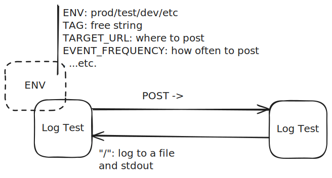

## synth-log-test
The purpose is to perform a synthetic test of the logging system in Kubernetes. 
Since there may be involved multiple components, the test involves at least two pods. 
Each pod generates an event every second (or with other frequescy set through the environment), sends a POST request to the other pod, and logs the event as outgoing and еhe other pod logs the event as incoming.

The test is successful if the logs are consistent and the events are received in the correct order. 

### Usage
```bash
kubectl apply -f synth-log-test.yaml
```

### Environment
- `ENV` - the environment to run the pod in. Default `dev`.
- `TAG` - the tag to identify the pod. Default pod name with a random suffix.
- `TARGET_URL` - the URL to send the POST request to. Default `http://localhost:8080`.
- `EVENT_FREQUENCY` - the frequency of the events, times per minute. Default 60.
- `FILE_NAME` - the name of the file to log to. Default ``, which means no file logging.
- `STDOUT` - whether to log to stdout. Default `true`.

